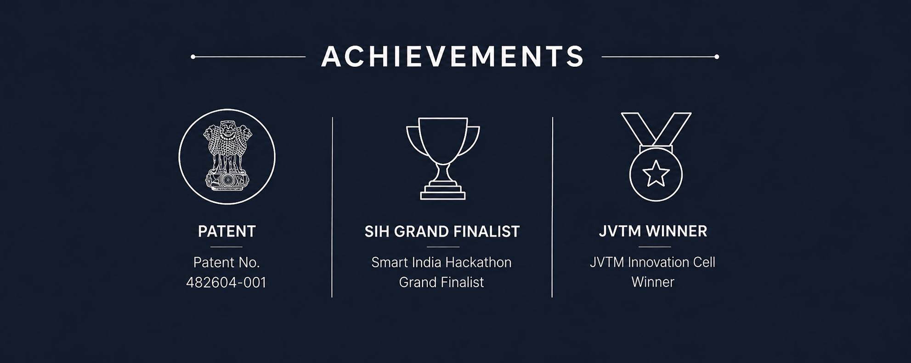
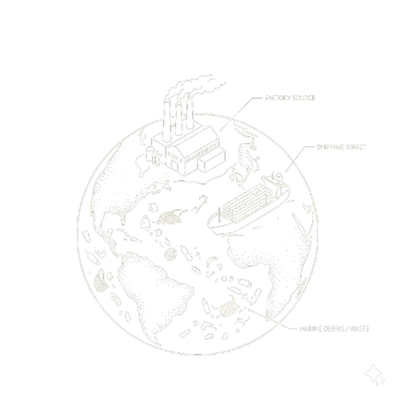
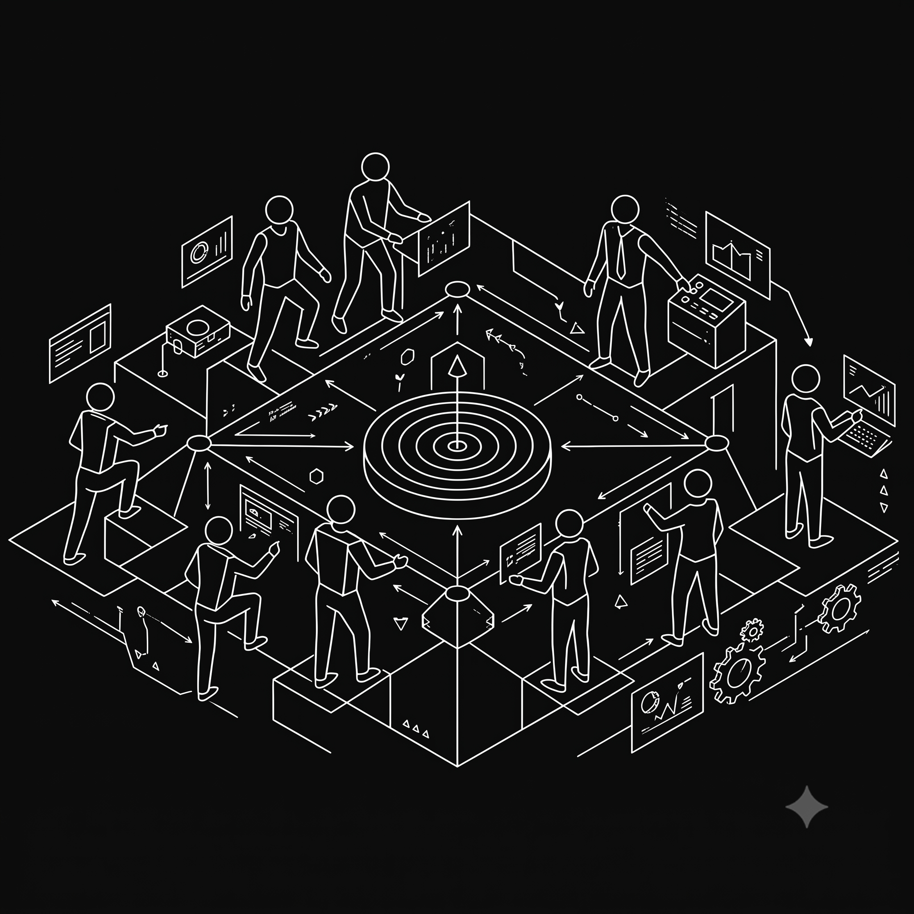

# Ullas M

### Building intelligent systems that connect AI, software, and the physical world.

**Information Science & Engineering • BGSCET, Bengaluru**

  

---

# About Me

I'm an Information Science & Engineering student passionate about building intelligent systems that bridge **AI, embedded hardware, and software**.

My work focuses on transforming ideas into real-world engineering solutions through **computer vision, edge AI, IoT, embedded systems, and rapid prototyping**.

I enjoy solving problems where software meets the physical world.

---

# Featured Engineering

## ♻️ Recylo — AI Waste Segregator

AI-powered waste segregation ecosystem combining computer vision, edge AI and automation to classify waste in real time.

Built for the **Smart India Hackathon 2025 Grand Finale**.

**Tech**
`Python`
`PyTorch`
`OpenCV`
`Raspberry Pi`
`Computer Vision`

---

## 🥤 IWM Reverse Vending Machine

An intelligent reverse vending machine featuring multi-layer bottle validation, weight verification, sensor fusion and automated reward generation.

Designed for scalable sustainable recycling infrastructure.

**Tech**
`Arduino`
`Sensors`
`Embedded Systems`
`Automation`

---

## 🌊 OceanOS

A marine intelligence platform exploring IoT, environmental monitoring, edge computing and real-time analytics for ocean sustainability.

**Tech**
`IoT`
`JavaScript`
`Node.js`
`Simulation`

---

## 👥 Only Friends

A social productivity platform built during the **ZeroOne chapter 1 Hackathon**, encouraging collaborative goal tracking and accountability.

🏅 **Runner-Up — ZeroOne Chapter 1**

**Tech**
`React`
`JavaScript`
`Supabase`
`Node.js`

---

# Engineering Milestones

🏆 **Smart India Hackathon 2025 Grand Finalist**

📜 **Government of India Design Patent**
**No. 482604-001**

💰 **₹1,00,000+ Incubation Funding**

🥇 **JVTM National Exhibition Winner**

🥈 **ZeroOne Chapter 1 Hackathon Runner-Up**

---

# Technologies

### Languages

### AI & Computer Vision

### Embedded & Edge

### Software

---

# GitHub Stats

 

---

### Build • Test • Break • Improve • Repeat

AI • Edge Computing • Embedded Systems • Computer Vision • IoT

  

